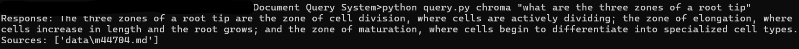

# LangChain Document Query System

This project implements an efficient document retrieval system using **LangChain**, powered by **HuggingFace embeddings** and a **Chroma vector store** for fast document search and retrieval. The system consists of two key scripts:

1. **`create_db.py`**: Processes `.txt` files from a specified directory, splits them into manageable chunks, and stores the processed data in a Chroma vector store database.
2. **`query.py`**: Allows you to query the Chroma database. It retrieves the most relevant documents based on your query and utilizes the retrieved context to generate a response.

---

## Installation

To set up the environment, make sure to install the required dependencies by running the following command:

```bash
pip install -r requirements.txt
```


---

## Creating the Vector Database

To create a vector database from your documents, use the `create_db.py` script. This script will process all `.txt` files in a given directory, chunk the content, and store it in a Chroma database for fast retrieval.

```bash
python create_db.py <text_directory> <db_directory>
```

---

## Querying the Database

Once the database is created, you can query it using the `query.py` script. This script takes a query text, retrieves the relevant documents from the Chroma database, and generates a response based on the context.


```bash
python query.py <db_directory> <query_text>
```

## Example 

